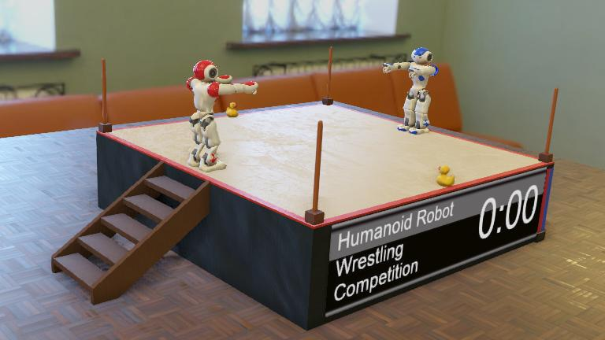

# ICRA Simulated Humanoid Robot Wrestling Competition

The competition focuses on the development of advanced humanoid robot control software for a wrestling game. It relies on a calibrated simulation model of the NAO robot, running in the Webots simulator with realistic physics, sensor and actuator simulation. Being spectacular and fairly easy to get started with, this competition aims at gathering a large number of competitors, both on-site and remotely. The fully open-source competition software stack was designed to be re-used as a template for other simulation-based robot competitions.



## Important Dates

| date               | description                             |
|--------------------|-----------------------------------------|
| December 1st, 2022 | registration is open                    |
| January 9th, 2023  | qualification matches are run every day |
| May 22nd, 2023     | selection of the best 32 teams          |
| May 29th, 2023     | 1/16 finals                             |
| May 30th, 2023     | 1/8 finals                              |
| May 31st, 2023     | 1/4 finals                              |
| June 1st, 2023     | semifinals                              |
| June 2nd, 2023     | third place game and final              |

The finals will take place during [ICRA 2023](https://www.icra2023.org) in London and will be broadcasted online in real time.

## Prize

The winning team will receive one Ethereum crypto-currency (currently priced around USD 1,260).

## Getting Started Now

To get started programming your wrestling robot, you will have to:

1. Download and install [Webots R2023a](https://github.com/cyberbotics/webots/releases/tag/R2023a).
2. Register to the competition by [forking](https://github.com/cyberbotics/wrestling/fork) this repository and clone it locally.
3. Start programming the behavior of a robot by editing its [controller program](controllers/wrestler_red/wrestler_red.py).

## Rules

The rules of game are implemented in the [wrestling referee supervisor](controllers/wrestling_referee/wrestling_referee.py).
They can be summarized as follow:

A game lasts until one of these two conditions occurs:
- **Knock-out**: If the altitude (along Z axis) of the center of mass of one robot remains below a given threshold for more than 10 seconds, then the other robot is declared the winner and the game is immediately over. This may happen if a robot falls down and cannot recover quickly or if it falls off the ring.
- **Time-out**: If no knock-out happened after 5 minutes, the robot having the greater ring *coverage* is declared the winner and the game is over. In the unlikely case of *coverage* equality, the winner is determined randomly. 

The *coverage* reflects how far a robot has moved inside the ring. It is computed over the time frame of a game from its maximum and minimum positions along the X and Y axes, respectively *X_max*, *X_min*, *Y_max* and *Y_min*, using the following formula:

```python
coverage = X_max + Y_max - X_min - Y_min
```

## Recommendation to Competitors

The earlier you start working on the competition, the better.
Starting early will allow you to compete with others from January 9th with an already pretty good robot controller.
The ranking algorithm will allow a very good robot controller to climp-up to the top of the leader board in one day.
However, in practice, it is recommended to enter the leader board rankings as early as possible.
This will allow you to compare your robot controller to others and have time to improve its performance.

## Upcoming Workflow

Starting from January 9th, 2023, games will run every day and a leaderboard will be updated accordingly.
We will soon publish a series of robot controllers that can serve as examples.
You will be able to store your robot controller program on a private GitHub repository to avoid disclosing it to others.
It will be possible to program the robot in any language (C, C++, Python, Java, ROS 2, etc.) with any library or python module.
In order to achieve this, your GitHub repository should contain a Dockerfile specifying on which environment your controller should run.

## More Information

This [paper](Simulated_Humanoid_Robot_Wrestling_Competition.pdf) (PDF) provides additional information about this competition.
